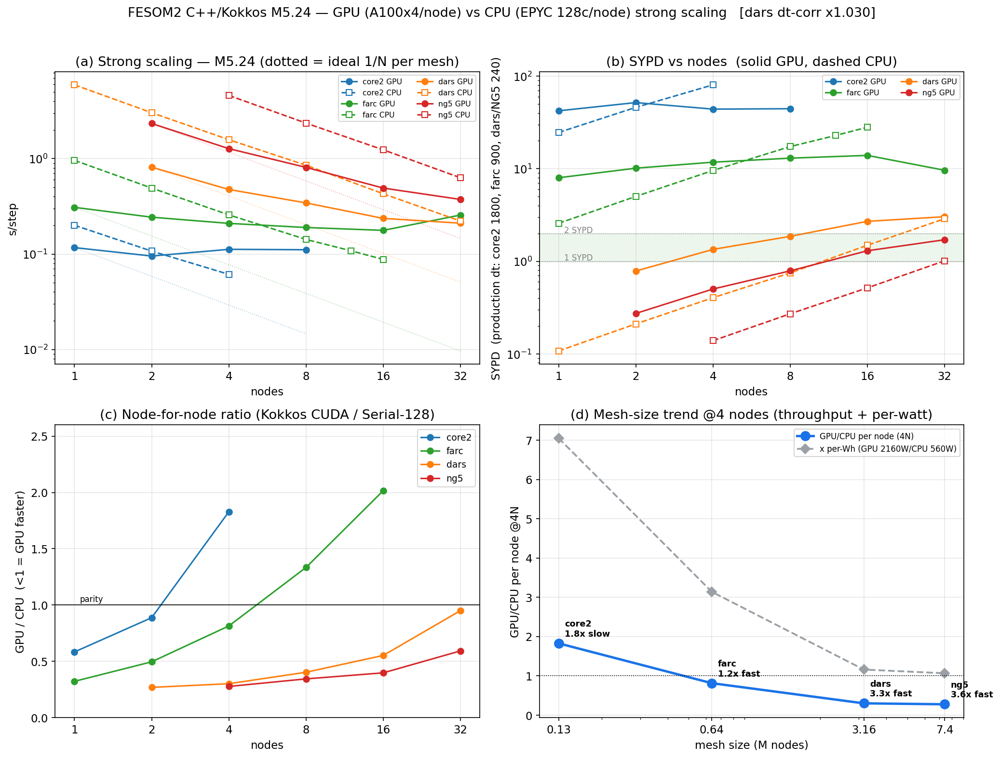
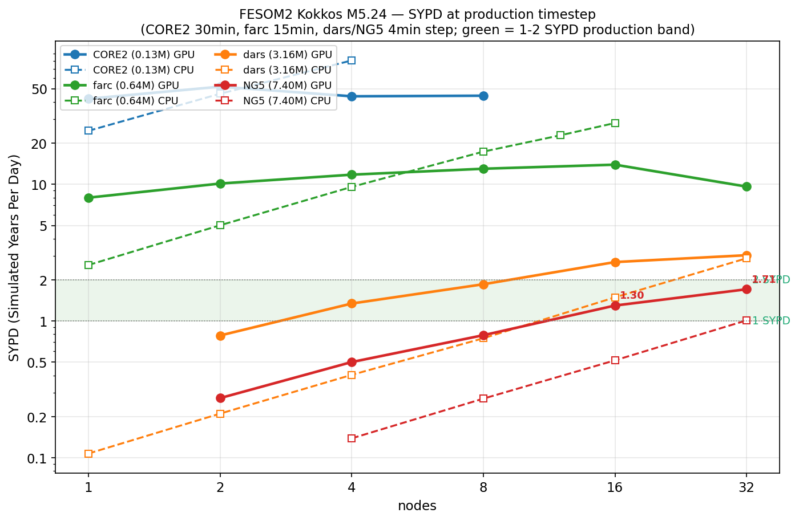

# FESOM2 — C++/Kokkos port (CPU + GPU)

A performance-portable **C++/[Kokkos](https://github.com/kokkos/kokkos)** port of the
FESOM2 (AWI) ocean + sea-ice model. One source tree compiles to **CPU (Serial / OpenMP)**
and **GPU (CUDA, A100)** backends — and is written Kokkos-pure so an **AMD/HIP (LUMI MI250x)**
backend is a build-config change, not a rewrite.

The whole ocean + sea-ice timestep is **device-resident** (halo exchange uses GPU-aware MPI;
no per-step full-field PCIe round-trips), and the port is validated against the
[literal C port](#relationship-to-the-c-port) it was grown from: the **Serial build is
bit-for-bit identical** to the C reference, and the **CUDA build is climate-close**.

~26 kLoC across `src/*.{cpp,hpp,h}`, mirroring the Fortran/C modules with the same loop
bounds and halo discipline. Built and exercised on DKRZ **Levante** (A100 GPU partition).

---

## Status

| | |
|---|---|
| **Backends** | Serial ✅ · OpenMP ✅ · CUDA (Ampere80) ✅ · HIP (gfx90a) planned (M6) |
| **Coverage** | Ocean + sea-ice fully device-resident & validated (M0–M4 tagged) |
| **Current** | `M5.x` GPU-performance campaign (tip `m5.23-comm-grind` → M5.24 TDMA lever) |
| **Kokkos** | 4.4.01, vendored as a git submodule, built in-tree (matches ICON) |
| **Precision** | `real_t = double` (mixed precision is the next major lever toward 2 SYPD) |

Milestone tags: `m0-baseline` → `m0-cpu-baseline` → `m1-datalayer` → `m2-ocean-device` →
`m4-full-device` → `m5.1-gpu-aware-mpi` → `m5.9-pin` → `m5.16-bulk-port` →
`m5.20-pcie-residency` → `m5.21-coalescing-ghats-sss` → `m5.23-comm-grind`.

---

## Performance (Levante, A100 vs EPYC, strong-scaling)

Measured on CORE2 / farc / dars / NG5 meshes (≈0.13M / 0.64M / 3.2M / 7.4M surface nodes),
GPU = 4× A100 per node (1 rank/GPU), CPU = 128 EPYC ranks per node. Full report:
[`docs/SCALING_M524.md`](docs/SCALING_M524.md).

- **Node-for-node, the GPU is 3.3–3.7× faster than a CPU node** on the big meshes (dars, NG5)
  at low node counts, drifting toward ~1.8–2.5× by 16 nodes as per-rank work thins and the
  step turns comm-bound.
- **SYPD at production timestep** (simulated years per wall-clock day): NG5 GPU ≈ **1.3–1.4 @ 16
  nodes → 1.71 @ 32 nodes**; dars GPU ≈ **1.9 @ 8N → 3.0 @ 32N** — both reach the target 1–2
  SYPD band on GPU.
- **5-way CPU/GPU compare** (same workload): the pure-C port ≈ Fortran (fastest, ±2%),
  Kokkos-Serial ~1.13–1.18× slower (portability tax), Kokkos-OpenMP ~7–8% over Serial; GPU
  2.45–3.25× faster than the fastest CPU on big meshes at low node counts (CPU catches up by 32N).




> ⚠️ The big meshes (dars/NG5) are CFL-unstable from a *cold* PHC start at the 4-min production
> step — that is a vertical-scheme robustness gap unmasked only at high vertical CFL, not an
> infrastructure issue. Step times are measured at a stable `dt=180`; SYPD is reported at the
> production `dt` via `dt/(365·s_step)`. Details in `docs/SCALING_M524.md`.

---

## Validation model

The port follows a strict fidelity ladder (the user's "binary-identity when possible, else
climate-close ≈ Fortran↔C noise"):

| Backend | Standard | How |
|---|---|---|
| **Serial** | **Bit-for-bit** == the C port | per-kernel `array_equal` gate + per-substep dumps; `-ffp-contract=off` so host & Serial-Kokkos forms compile to the same mul+add |
| **OpenMP** | climate-identical | only reduction-order differs |
| **CUDA / HIP** | climate-close | fma contraction, libdevice transcendentals, atomic/reduction order → ~1e-3 floor, 1-yr CORE2 climate correlation ≈ 1.0 vs the C twin |

Any device-halo / sync-rail / residency change must pass
**`scripts/gpu_fidelity_gate.sh`** before commit — a CORE2 active-ice CUDA-vs-Serial diff.
(The pi smoke is *insufficient*: it has no sea ice, so a stale-host bug hides at ~1e-17 there.)

---

## Build

Kokkos is vendored at `externals/kokkos`. First checkout must init the submodule:

```bash
git submodule update --init --recursive
```

There is no Kokkos module on Levante — it builds in-tree. `cmake` is the system `/usr/bin/cmake`
(3.26.5), which survives `module purge`. Full recipe: [`docs/BUILD.md`](docs/BUILD.md).

### Serial (the bit-identity oracle / CPU default)

```bash
bash -l configure.sh            # → build/fesom_port  (incremental; --clean to wipe)
```

`configure.sh` sources `env.sh` (gcc-11 / openmpi-4.1.2 / netcdf-c) and builds a Serial backend.
The `bash -l` is required so the `module load` calls see Levante's profile. **Don't build inside
a mambaforge/conda env** — it picks up the wrong mpicc/netcdf and fails at link time
(`module --force purge` in `env.sh` clears an already-activated one).

Explicit per-backend builds (one build dir each):

```bash
# Serial
cmake -S . -B build-serial -DCMAKE_BUILD_TYPE=Release -DKokkos_ENABLE_SERIAL=ON
cmake --build build-serial -j

# OpenMP
cmake -S . -B build-omp -DCMAKE_BUILD_TYPE=Release -DKokkos_ENABLE_OPENMP=ON
cmake --build build-omp -j
```

### CUDA (A100) — needs CUDA-aware MPI

The GPU build uses the **NVIDIA-built `openmpi/4.1.5-nvhpc-24.7`** (CUDA-aware UCX), *not* the
Serial toolchain's `openmpi/4.1.2` — device-pointer MPI segfaults on the latter. Source
`env_cuda.sh` in the **same** shell as the configure + build:

```bash
source env_cuda.sh             # gcc-11 + nvhpc-24.7 + CUDA-aware openmpi-4.1.5
cmake -S . -B build-cuda -DCMAKE_BUILD_TYPE=Release \
      -DKokkos_ENABLE_CUDA=ON -DKokkos_ARCH_AMPERE80=ON \
      -DCMAKE_CXX_COMPILER=$PWD/externals/kokkos/bin/nvcc_wrapper
cmake --build build-cuda -j
```

### LUMI (AMD / HIP) — later (M6)

Same submodule, no source changes (the no-vendor-lock contract):
`-DKokkos_ENABLE_HIP=ON -DKokkos_ARCH_AMD_GFX90A=ON` with ROCm `hipcc` as `CMAKE_CXX_COMPILER`.

### Diagnostic build options

| CMake option | Effect |
|---|---|
| `-DFESOM_KK_SYNCCHECK=ON` | Assert host/device `Field` coherence + bounce evolving state H↔D every step (catches stale-host reads). Compiled out by default. |
| `-DFESOM_SYNC_LOG=ON` | Emit one `SYNCLOG D2H/H2D <label> <bytes>` line per real PCIe sync — used for per-field traffic attribution. |

Build these into **separate** dirs; both are no-ops when off so the production build stays
byte-identical.

---

## Running

```
fesom_port <mesh_dir> [output_dir] [dt_seconds] [nsteps] [snap_every] [phc_nc_path] [jra55_year]
```

| arg | required | default | notes |
|---|---|---|---|
| `mesh_dir` | yes | — | CORE2-style mesh directory |
| `output_dir` | no | none → no snapshots | where `snap_*.nc` lands (`mkdir -p` it first!) |
| `dt_seconds` | no | compiled default | overrides timestep |
| `nsteps` | no | 500 | total steps |
| `snap_every` | no | 25 | step interval between NetCDF snapshots; `-1` = none (timing runs) |
| `phc_nc_path` | no | none → analytical forcing | PHC initial-condition file |
| `jra55_year` | no | 0 → no JRA forcing | year for JRA55-do daily forcing |

Empty-string args (`""`) mean "use default", useful to override only later positionals.

The backend is chosen at **build** time (which `build*/fesom_port` you run), not at runtime.
The model picks `dist_<npes>` under the mesh from the SLURM `--ntasks` count, so a partition
directory for that exact rank count must exist.

### GPU SLURM job (4 A100 / node)

```bash
#!/bin/bash
#SBATCH --job-name=fesom_gpu
#SBATCH -p gpu
#SBATCH -A ab0995
#SBATCH --ntasks-per-node=4
#SBATCH --gres=gpu:4
#SBATCH --gpu-bind=none
#SBATCH --time=01:00:00
#SBATCH -o /work/ab0995/a270088/port2/run_<stamp>/slurm.%j.out
#SBATCH -e /work/ab0995/a270088/port2/run_<stamp>/slurm.%j.err

ROOT=/home/a/a270088/port_kokkos
source "$ROOT/env_cuda.sh"
export OMPI_MCA_pml=ucx OMPI_MCA_btl=self UCX_NET_DEVICES=mlx5_0:1
export UCX_MEMTYPE_CACHE=n OMPI_MCA_coll_hcoll_enable=0
export OMPI_MCA_io=romio321 HDF5_USE_FILE_LOCKING=FALSE

OUT=/work/ab0995/a270088/port2/run_<stamp>; mkdir -p "$OUT"
MESH=/pool/data/AWICM/FESOM2/MESHES_FESOM2.1/core2
PHC=/home/a/a270088/FESOM_port/fesom2/tests/data/INITIAL/phc3.0/phc3.0_winter.nc

srun "$ROOT/build-cuda/fesom_port" "$MESH" "$OUT" 1800 200 50 "$PHC" 1958 \
    > "$OUT/run.log" 2>&1
echo "Exit: $?"; tail -3 "$OUT/run.log"
```

### CPU SLURM job (Serial backend, pure MPI)

Same shape with `-p compute`, `--ntasks-per-node=128`, `source env.sh`, and the
`build-serial/fesom_port` binary. Ready-made templates live in `jobs/` (e.g.
`job_m524_scale_{gpu,cpu}`, `submit_m524_scaling.sh`).

> **Always use a unique `OUT_DIR` per job.** Concurrent jobs sharing an `OUT_DIR` clobber each
> other's logs and produce spurious "crashes" that are really log corruption. Send output to
> `/work/...`, never `$HOME` (60 GB home quota; a CORE2 GPU run is ~3.5 GB).

---

## Data on Levante

| Asset | Path |
|---|---|
| CORE2 mesh | `/pool/data/AWICM/FESOM2/MESHES_FESOM2.1/core2` |
| PHC3.0 winter IC | `/home/a/a270088/FESOM_port/fesom2/tests/data/INITIAL/phc3.0/phc3.0_winter.nc` |
| JRA55-do forcing | reader hard-codes the `/pool/data/.../JRA55-do/` layout for the requested year |
| Output | `/work/ab0995/a270088/port2/...` |

Mesh layout the model expects under `<mesh_dir>`: the global files `nod2d.out`, `elem2d.out`,
`aux3d.out`, `nlvls.out`, `elvls.out`, `edges.out`, `edge_tri.out`, `depth.out`, plus
`dist_<NPES>/my_list*.out` + `com_info*.out` partition files **pre-generated for the exact
rank count** you run (generated with `fesom_ini.x`).

---

## Physics included

- **Ocean**: **linfs** (default) or **zstar** ALE vertical coordinate, JM-EOS, hydrostatic PGF
  (Shchepetkin density-Jacobian under zstar), AB2 Coriolis, FCT tracer advection,
  `opt_visc=5` backscatter, **KPP** (default) / PP / **CVMix classical TKE** vertical mixing +
  convective adjustment, parallel-CG SSH solver, JRA55 forcing with NCAR bulk formulae,
  SSS restoring + runoff.
- **Sea ice**: **standard EVP** (default) or **modified EVP (mEVP)** dynamics, thermodynamics with
  freezing T-clamp, ice-ocean coupling (ocean2ice / oce_fluxes / oce_fluxes_mom), FCT advection of
  `a_ice / m_ice / m_snow`.
- **GM/Redi**: Ferrari et al. (2010) bolus velocity + isoneutral Redi diffusion, ODM95 slope
  tapering, `scaling_GMzexp` vertical scaling. Master off-switch `FESOM_NO_GMREDI=1` makes the
  binary byte-identical to the pre-GM state.
- **I/O & calendar**: serial gather-to-rank-0 NetCDF snapshots + configurable output streams.

---

## Environment knobs

All read once at first use unless noted.

**Physics options (M6).** Each defaults OFF; with every knob unset the binary is byte-identical
to the pre-M6 model, and each was ported strictly faithfully to the C reference — all three are
**bit-identical to the C oracle on Serial, individually and all three at once**:

| knob | values | default | what it selects |
|---|---|---|---|
| `FESOM_MIX_SCHEME` | `KPP` \| `PP` \| `TKE` (= `cvmix_TKE`) | `KPP` | ocean vertical mixing (TKE = CVMix classical, Gaspar 1990) |
| `FESOM_WHICH_EVP` | `0` \| `1` | `0` | sea-ice rheology (`1` = modified EVP, α=β=250) |
| `FESOM_ALE` | `linfs` \| `zstar` | `linfs` | vertical coordinate (`zstar` = moving levels + Shchepetkin PGF + real freshwater fluxes) |

An unrecognised value **aborts loudly** rather than silently falling back.

**Vertical-velocity splitter (`use_wsplit`, M7 — certified 2026-08-04).** Where the vertical CFL
exceeds a threshold, the vertical advection velocity is split into an explicit part (`w_e`, kept
under the CFL bound) and an implicit part (`w_i`, transported by an unconditionally stable
vertical solve). **High-resolution meshes need it**: Fortran NG5 dist_4096 at dt=180 from a cold
start dies without it (job 26360443, T-NaN at step 230) and completes 300 steps with it (26360444).

| knob | values | default | what it does |
|---|---|---|---|
| `FESOM_WSPLIT` | `0` \| `1` | `0` | enables the splitter (Fortran `use_wsplit`) |
| `FESOM_WSPLIT_MAXCFL` | float > 0 | `1.0` | CFLz trigger threshold (Fortran namelist `wsplit_maxcfl`) |

The port warns on rank 0 when a mesh above 500k surface nodes runs with the splitter off, and
repeats the hint if the run then blows up. It is a warning, never an abort — the real trigger is
CFLz > maxcfl, which depends on dt and the state, not on mesh size alone.

⚠️ **The threshold matters when testing.** On CORE2 at dt=1800 the CFLz peaks at 0.822 in 20
steps, so at the default 1.0 the splitter never fires and `FESOM_WSPLIT=1` is bit-identical to
off (measured: job 26695054). The certification set below therefore runs at
`FESOM_WSPLIT_MAXCFL=0.3`, where the implicit share reaches ~63% of `w` — verified in the run,
not assumed (L80).

| gate (CORE2 dist_8, 20 steps, dt1800) | job | verdict |
|---|---|---|
| knob-OFF byte (Serial) | 26695169 | ✅ rc=0 bit-identical |
| knob-OFF fidelity (CUDA) | 26695244 | ✅ PASS |
| wsplit ON, Serial — *must* differ from OFF | 26695170 | ✅ differs (splitter fired; `w_i/w` ≈ 0.63) |
| **wsplit ON, CUDA vs Serial** | **26695245** | ✅ **PASS (worst 7.4e-03)** — first execution of the device vertical solver |
| wsplit + TKE, CUDA vs Serial | 26695246 | ✅ PASS |
| wsplit + mEVP, CUDA vs Serial | 26695247 | ✅ PASS |
| wsplit + zstar, CUDA vs Serial | 26695248 | ✅ PASS (`Kv` 9.999e-02 = the L79 zstar control; 2 isolated `u` outliers, L75 class) |

Not covered: the device path has not been run at high resolution (the July evidence that the port
tracks Fortran's arc on NG5 is CPU-only), and there is no multi-year climate leg with the splitter
on. Both are single runs if wanted, not campaigns.

**Cost:** no measurable cost on CORE2 at 8 ranks (8×A100) — every knob's delta (−0.8% to +1.5%)
is smaller than the 5.6% run-to-run spread of the *identical* default configuration across jobs.
⚠️ That is the only size measured: **no large mesh, no strong scaling, no SYPD.** CORE2/8 is
~16k 2D-verts/rank, and the bottleneck flips with per-rank load, so this does **not** establish
cost at scale — zstar in particular adds a full NOD3D halo exchange every step. See
`docs/GPU_FIDELITY.md` §M6.4.

**Speed levers (M7).** Each defaults OFF; with every knob unset the binary is **byte-identical**
to the pre-M7 model. `FESOM_SPEED=1` is the master switch (turns all four ON); a per-lever
`FESOM_SPEED_<NAME>=0|1` always overrides it. **They act on the CUDA path only** — the Serial
backend keeps the legacy bit-identical-to-C path (the debug oracle).

**All four are BIT-IDENTICAL** — they delete redundant work, they do not trade accuracy for speed:

| knob | default | what it does | A/B (NG5@4N) |
|---|---|---|---|
| `FESOM_SPEED_SWSKIP` | off | Skip the **dead** host `sw_3d` computation. `fesom_cal_shortwave_rad` (host) and `fesom_cal_shortwave_rad_kk` (device) both run every step; the device twin zeroes and rewrites the whole array, so the host's `sw_3d` work (a 261 MB/rank/step `memset` + an `exp()` column walk) is overwritten microseconds later. Its only real output — the nod2D `heat_flux += swsurf` — is kept. | **−26.5%** |
| `FESOM_SPEED_ICEFLUXDEV` | off | Run `fesom_ice_oce_fluxes_mom` on the device (it was a host loop over device-resident arrays). | −0.7% |
| `FESOM_SPEED_NOFENCE2` | off | Drop the post-unpack halo `Kokkos::fence()`. Safe because every consumer is a kernel on the same stream and the *next* exchange's pre-MPI fence is unconditional. | ~−0.8% |
| `FESOM_SPEED_IOACC` | off | Device accumulators for the last six host-resolved output vars (`ssh`, `a_ice`, `m_ice`, `m_snow`, `uice`, `vice`). | ~−1.1% |
| **`FESOM_SPEED=1`** | off | **all four** | **−28.4%** |

**Effect (measured, `docs/GPU_SPEED_M7.md`).** GPU-node vs CPU-node ratio:

| | before | **with `FESOM_SPEED=1`** |
|---|--:|--:|
| NG5 @ 4 nodes | 3.60× | **5.03×** |
| NG5 @ 8 nodes | 3.20× | **4.28×** |
| NG5 @ 16 nodes | 2.72× | **3.55×** (SYPD@dt240 1.42 → **1.86**) |

⚠️ **The gain tracks per-rank domain size** (−28.5% at ~462k nod2D/rank → −17.5% at ~99k), because
the levers remove *host* work. Do not extrapolate one scale point's factor to another.

**Validated:** knob-OFF byte-identical at every commit; `SWSKIP`/`ICEFLUXDEV`/`IOACC` each pass a
**FORCE_SERIAL byte proof** (the levered code runs on Serial and reproduces the certified baseline
byte-for-byte); `NOFENCE2` changes no arithmetic and is `compute-sanitizer memcheck`-clean; and a
1-yr CORE2 climate run with all four ON matches the un-levered baseline to five decimals
(sst 1.00000, sss 0.99996, ssh 1.00000, a_ice 0.99997 vs both Fortran and the C port).

⚠️ **`FESOM_SPEED_FORCE_SERIAL=1`** is a **dev-only** escape hatch: it lets the levers run on the
Serial backend for those byte proofs. Never set it in production. Do not combine `SWSKIP` with a
`-DFESOM_KK_VERIFY` build — the verify-only `kpp_bldepth` twin reads the host `sw_3d`.

**Physics master switches:** `FESOM_NO_GMREDI`, `FESOM_NO_ICE_DYN`, `FESOM_NO_ICE_ADV`,
`FESOM_NO_ICE_THERMO` — each skips its subsystem (the GMREDI one is the byte-identity gate).

**Diagnostics:** `FESOM_PRINT_EVERY=N` (per-step stats cadence), `FESOM_VERBOSE_CG=1`
(SSH CG iteration detail), `FESOM_SYNC_LOG`-built binary emits per-field PCIe traffic.

**Physics-bisect toggles** (zero a forcing term *after* it is computed, to localize a multi-rank
divergence): `FESOM_NO_WIND`, `FESOM_NO_HFLUX`, `FESOM_FREEZE_TS`, `FESOM_NO_TRADV`,
`FESOM_NO_TRDIFF`. Independent — combine freely.

---

## Output

`<output_dir>/snap_NNNNNN.nc` (one per `snap_every`, `NNNNNN` = zero-padded step). Each holds:

- **Mesh**: `lon`, `lat`, `zbar`, `Z`, `elem_nodes`, `nlevels_nod2D`, `nlevels`.
- **Ocean**: `T`, `S`, `eta_n`, `w`, `u`, `v`, `density_m_rho0`, `bvfreq`, `pgf_x`, `pgf_y`, `Kv`, `Av`.
- **Sea ice** (when configured): `a_ice`, `m_ice`, `m_snow`, `uice`, `vice`, `h_ice`, `h_snow`.
- **Globals**: `:step`, `:dt`.

Per-step text stats go to `run.log`; per-rank stderr to `run.err`.

---

## Source layout

```
src/
  fesom_main.cpp             CLI parsing, Kokkos/MPI init, timestep loop, exit
  fesom_step.cpp             one ALE + adv + diff + ice timestep (the driver)
  fesom_field.hpp            FieldT<T> DualView wrapper (host↔device, h()/d()/sync/modify)
  fesom_mesh / fesom_partit / fesom_mpi              mesh I/O, partition + halo state, MPI bootstrap
  fesom_halo / fesom_halo_device                     host MPI halo + GPU-aware on-device halo exchange

  fesom_aux / fesom_dyn / fesom_tracers / fesom_forcing(_analytical)   ocean state + forcing fields
  fesom_eos / fesom_ale / fesom_momentum / fesom_pp / fesom_kpp        EOS, ALE, momentum, PP/KPP mixing
  fesom_ssh / fesom_tracer_adv / fesom_tracer_diff / fesom_gm          CG SSH, FCT advection, vert diff, GM/Redi
  fesom_jra55 / fesom_bulk / fesom_phc / fesom_ic / fesom_sss_runoff   JRA55 reader, NCAR bulk, IC, restoring

  fesom_ice* (driver / evp / thermo / coupling / fct / types)          sea ice
  fesom_io / fesom_io_stream* / fesom_io_config / fesom_calendar       NetCDF I/O, output streams, calendar
  fesom_profile.{cpp,hpp}    internal loop timer + phase profiling
```

Every routine carries a `Fortran <file>:<line>` (or C-port) provenance comment — grep
`Mirror of` / `Fortran` to navigate back to the producer.

---

## Documentation in tree

| Doc | What |
|---|---|
| [`docs/BUILD.md`](docs/BUILD.md) | Per-backend build recipes + Kokkos smoke tests |
| [`docs/KOKKOS_PORTING_LESSONS.md`](docs/KOKKOS_PORTING_LESSONS.md) | Running lesson log (D1–D22, L1–L72) — every gotcha paid for |
| [`docs/GPU_FIDELITY.md`](docs/GPU_FIDELITY.md) | The GPU-perf campaign §M5.1–§M5.24 + the fidelity model |
| [`docs/PROFILE_M522.md`](docs/PROFILE_M522.md) | Deep budget profile (compute-bound @low-N vs comm-bound @high-N) |
| [`docs/SCALING_M524.md`](docs/SCALING_M524.md) | Latest strong-scaling / SYPD / step-profile sweep + the cold-start CFL finding |
| `docs/plans/` | Phase plans (completed + active) |
| `docs/figures/` | Scaling / SYPD / profile plots |

---

## Relationship to the C port

This port was grown from a **validated literal C port** of FESOM2
(`/home/a/a270088/port2/fesom2_port`, GitHub `koldunovn/fesom_port`), which itself reproduces the
Fortran CORE2 climate to SST/SSS RMS ~0.005–0.04. The strategy was incremental:

1. Flip the C sources to C++/Kokkos for a **bit-identical baseline** (Serial == C, byte-for-byte).
2. Wrap each persistent field in a Kokkos `DualView` (`FieldT`).
3. Convert kernels to `parallel_for` one at a time, gating every step on the Serial bit-identity
   diff and the CUDA fidelity gate — until the whole ocean + sea-ice runs device-resident.

The C port stays the bit-identity oracle, and the Fortran source
(`/home/a/a270088/port2/fesom2/src`) is the climate ground truth.

---

## Troubleshooting

- **Linker errors against MPI / NetCDF** — you're not in a clean shell. Log back in and build via
  `bash -l configure.sh`; `which mpicc` must be `/sw/spack-levante/openmpi-...`, not `~/mambaforge/...`.
- **Device-pointer MPI segfault on the GPU build** — you sourced `env.sh` instead of `env_cuda.sh`.
  The `openmpi/4.1.2` UCX has no CUDA transports; the GPU build needs `openmpi/4.1.5-nvhpc-24.7`.
- **Multi-rank CG NaN early in a step** — usually a halo-coverage gap on a forcing/aux field read
  at halo. Bisect with `FESOM_NO_TRADV=1` → `_TRDIFF` → `_NO_WIND` → `_NO_HFLUX`.
- **Job hangs at startup** — wrong `dist_<npes>` for `--ntasks`; match it to an existing partition dir.
- **`bash: module: command not found` in a job** — missing `source /sw/etc/profile.levante` before `env*.sh`.
- **Blowup from a cold start on dars/NG5 at the production `dt`** — expected; the cold PHC IC exceeds
  vertical CFL. Run from a spun-up restart or a smaller `dt` (see `docs/SCALING_M524.md`).
```
